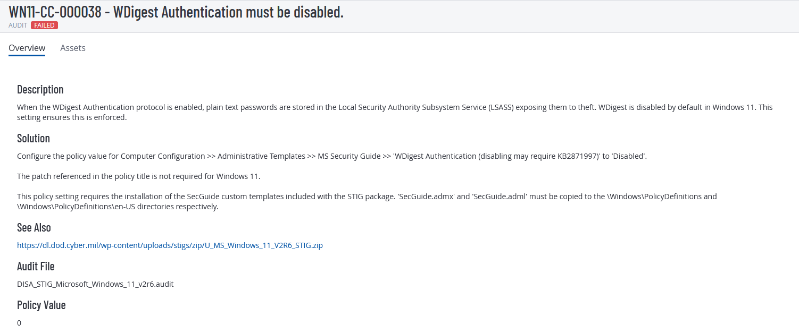

# STIG #1 — WN11-CC-000038



## What is the STIG ID?
**WN11-CC-000038** — WDigest Authentication must be disabled.

WDigest stores plaintext passwords in LSASS memory, which can be scraped by credential-dumping tools (e.g., Mimikatz). Disabling it forces Windows to skip the protocol entirely.

## How I'm fixing it
The scanner checks one registry value:

| Field | Value |
|---|---|
| Key  | `HKLM\SYSTEM\CurrentControlSet\Control\SecurityProviders\WDigest` |
| Name | `UseLogonCredential` |
| Type | `REG_DWORD` |
| Data | `0` |

**PowerShell (run as Administrator):**

```powershell
$path = "HKLM:\SYSTEM\CurrentControlSet\Control\SecurityProviders\WDigest"
New-ItemProperty -Path $path -Name "UseLogonCredential" -Value 0 -PropertyType DWORD -Force

# Local verify
Get-ItemProperty -Path $path -Name "UseLogonCredential"
```

## Scan results verifying remediation


